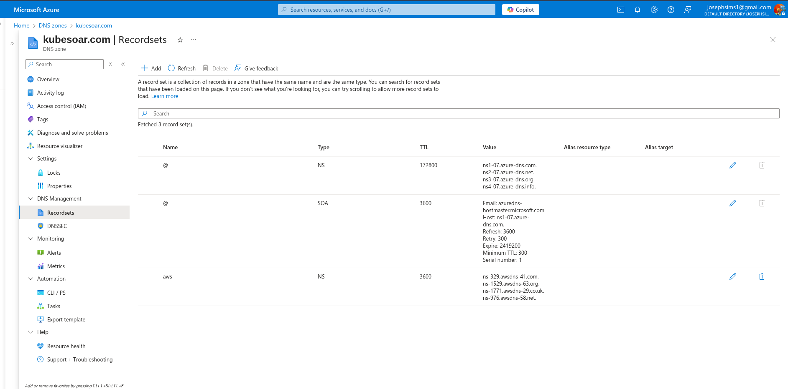
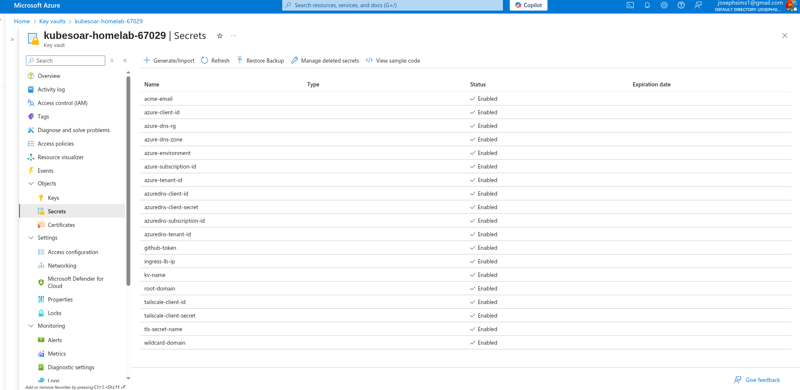
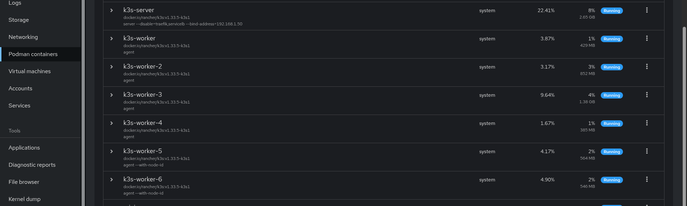
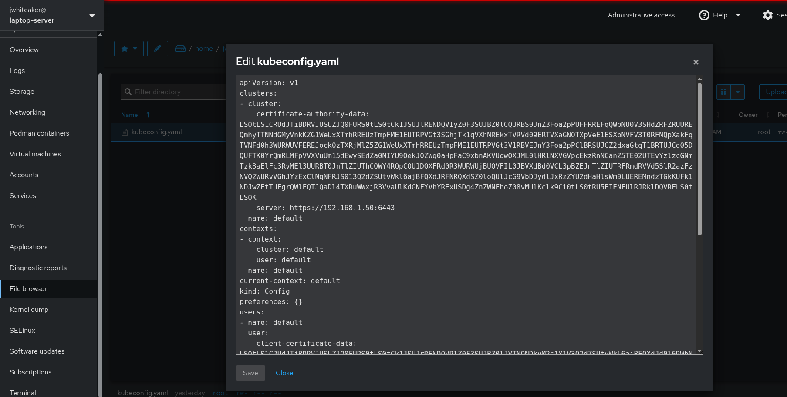
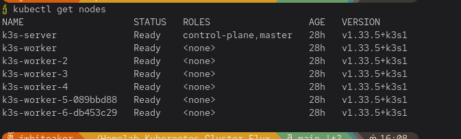

# Homelab GitOps — FluxCD + External Secrets Operator

This repository bootstraps my **homelab Kubernetes cluster** using a full **GitOps** workflow powered by **FluxCD** and **External Secrets Operator (ESO)**.  
All secrets are securely managed in **Azure Key Vault**, keeping the entire cluster declarative, reproducible, and secret-free in Git.

---

## 🔧 Concept

The goal of this setup is to have **a fully automated, self-healing homelab** that syncs everything from Git — including secrets, operators, and infrastructure — without ever manually applying manifests or storing sensitive data in the repo.

Flux continuously watches this repo, applies changes automatically, and delegates secret management to ESO, which fetches them directly from Azure Key Vault.

---

## Domain & DNS Setup

I own the domain **kubesoar.com**, which I purchased through **Hostinger** and manage via **Azure DNS**.

<p align="center">
  
</p>

To enable certificate automation, I created an **Azure AD Service Principal** with the **DNS Zone Contributor** role on my DNS zone.  
This service principal is used by **cert-manager** to perform DNS-01 challenges and automatically verify ownership of my domain.

**In short:**
- Domain: `kubesoar.com` (and `*.kubesoar.com`)
- Managed in: Azure DNS  
- Certificate automation handled by: cert-manager  
- Authenticated using: Azure AD Service Principal  

---

## Secret Management — Key Vault + ESO

Secrets are not committed or templated anywhere in this repo.  
Instead, I use **Azure Key Vault** as the source of truth, and **External Secrets Operator (ESO)** pulls those secrets into Kubernetes automatically.

<p align="center">
  
</p>

This approach provides all the benefits of GitOps **without** the complexity of tools like Sealed Secrets.  
Secrets can be updated in Key Vault, and ESO will sync the updates automatically into the cluster — no re-commit or redeploy required.

**Why not Sealed Secrets?**  
They're cumbersome for secret rotation, noisy in Git history, and harder to automate.  
ESO + Key Vault is simpler, scalable, and cloud-native.

> **💡 Production Note:** If you're running this on **Azure Kubernetes Service (AKS)**, I would highly recommend using **Workload Identity** instead of service principals with client secrets. This involves creating a managed identity with a federated identity that grants a specific service account access to the managed identity in a specific namespace. You'll need OIDC and Workload Identity enabled on your AKS cluster. However, since I'm running this in my homelab via podman containers on a podman macvlan network in my homelab's LAN, I'm using service principals and client secrets for this specific setup. This isn't what I would do in AKS, but it's about all you can do in a homelab environment.

---

## Quick Start

### Step 0 — Create ESO Credentials (One-Time Manual Step)

```bash
kubectl create namespace external-secrets

kubectl -n external-secrets create secret generic akv-eso-creds \
  --from-literal=ClientID='<ESO_SP_APP_ID>' \
  --from-literal=ClientSecret='<ESO_SP_SECRET>'
```

This is the only manual secret. Everything else is fetched automatically from Azure Key Vault.

---

### Step 1 — Create & Populate Your Azure Key Vault

Use the Azure CLI to create a **Standard SKU** Key Vault and populate it with these secrets.

#### Cert-Manager DNS

* `azuredns-client-id`
* `azuredns-client-secret`
* `azuredns-subscription-id`
* `azuredns-tenant-id`

#### Flux Variables

* `acme-email`
* `azure-dns-zone`
* `azure-client-id`
* `azure-dns-rg`
* `azure-subscription-id`
* `azure-tenant-id`
* `azure-environment`
* `ingress-lb-ip`
* `root-domain`
* `wildcard-domain`
* `tls-secret-name`
* `kv-name`

#### Other Integrations

* **Tailscale**: `tailscale-client-id`, `tailscale-client-secret`
* **Actions Runner Controller (GitHub PAT)**: `github-token`

---

### Step 2 — Bootstrap Flux

```bash
flux bootstrap github \
  --owner josephaw1022 \
  --repository Homelab-Kubernetes-Cluster-Flux \
  --branch main \
  --path clusters/homelab
```

Flux will automatically:

1. Install and configure Helm repositories.
2. Deploy External Secrets Operator and connect it to Azure Key Vault.
3. Sync all required secrets into the cluster.
4. Install all core infrastructure:

   * cert-manager
   * MetalLB
   * ingress-nginx
5. Deploy operational tooling:

   * metrics-server, reloader, opentelemetry-operator, CNPG, Strimzi, Redis Operator
6. Create a TLS-secured fallback site for `${ROOT_DOMAIN}` and `${WILDCARD_DOMAIN}`.

---

### Step 3 — Verify Everything

```bash
kubectl -n external-secrets get pods

kubectl -n cert-manager get clusterissuer homelab-issuer -o yaml | grep -A3 conditions:

kubectl -n ingress-nginx get svc ingress-nginx-controller -o wide

kubectl -n fallbacksite get ingress fallback -o yaml | grep tls: -A5
```

You should see ESO pods running, a ready ClusterIssuer, and a valid ingress with a TLS section.

---

## Repository Structure

```
.
├── apps/
│   └── fallbacksite/
├── clusters/
│   └── homelab/
├── infra/
│   ├── cert-manager/
│   ├── external-secrets/
│   ├── ingress-nginx/
│   ├── kyverno/
│   ├── metallb/
│   └── ...
├── assets/
│   ├── azure-dns.png
│   └── azure-keyvault-secrets.png
└── README.md
```

---

### Notes

* Only `external-secrets/akv-eso-creds` is manually created.
* All other secrets are created dynamically by ESO.
* Secret rotation is handled automatically via Key Vault sync.
* Flux continuously reconciles all manifests and Helm releases under `clusters/homelab`.

## Homelab Cluster Setup

This Kubernetes homelab cluster runs entirely inside Podman containers connected via a macvlan network, giving each node its own IP on the LAN. All of this is done on my RHEL Linux server (just an old lenovo thinkpad).This is not run on one of my bigger servers, but it could be.

<p align="center">
  
</p>


#### 🕸️ Create the Podman Network

```bash
# delete old if needed
sudo podman network rm homelabnetwork || true

# recreate with a managed pool
sudo podman network create \
  --driver macvlan \
  --subnet 192.168.1.0/24 \
  --ip-range 192.168.1.48/28 \
  --gateway 192.168.1.1 \
  --opt parent=enp0s25 \
  homelabnetwork
```


#### 🧩 Create the K3s Cluster with Podman

Save this as create-k3s-cluster.sh and run it.
It automatically creates one server and multiple worker containers on the macvlan network.

```bash
#!/usr/bin/env bash
set -euo pipefail

# ------- Config (override via env if you like) -------
NETWORK_NAME="${NETWORK_NAME:-homelabnetwork}"
IP_BASE="${IP_BASE:-192.168.1}"        # the /24 base (no last octet)
SERVER_OCTET="${SERVER_OCTET:-50}"     # server IP will be ${IP_BASE}.${SERVER_OCTET}
WORKER_START_OCTET="${WORKER_START_OCTET:-51}"  # first worker IP
WORKER_COUNT="${WORKER_COUNT:-6}"      # number of workers (k3s-worker-1..N)
K3S_VERSION="${K3S_VERSION:-v1.33.5-k3s1}"
K3S_TOKEN="${K3S_TOKEN:-}"             # if empty, will auto-generate
K3S_OUTPUT_DIR="${K3S_OUTPUT_DIR:-$HOME/k3s-output}"

# Podman ulimits for k3s
ULIMITS=(--ulimit nofile=1048576:1048576 --ulimit nproc=131072:131072)

SERVER_NAME="k3s-server"
SERVER_IP="${IP_BASE}.${SERVER_OCTET}"

mkdir -p "$K3S_OUTPUT_DIR"

if [ -z "$K3S_TOKEN" ]; then
  # 64-char hex -> sha256 -> hex; k3s accepts arbitrary token strings
  K3S_TOKEN="$(head -c 32 /dev/urandom | od -An -tx1 | tr -d ' \n')"
  K3S_TOKEN="$(printf "%s" "$K3S_TOKEN" | sha256sum | awk '{print $1}')"
  echo "Generated K3S_TOKEN: $K3S_TOKEN"
fi

echo "Network: $NETWORK_NAME"
echo "Server:  $SERVER_NAME @ $SERVER_IP"
echo "Workers: ${WORKER_COUNT} starting at ${IP_BASE}.${WORKER_START_OCTET}"
echo "Version: $K3S_VERSION"
echo

# -------- Helpers --------
exists() { sudo podman ps -a --format '{{.Names}}' | grep -Fxq "$1"; }

recreate_container() {
  local name="$1"
  if exists "$name"; then
    sudo podman stop "$name" >/dev/null || true
    sudo podman rm "$name" >/dev/null || true
  fi
}

# -------- Server --------
recreate_container "$SERVER_NAME"
echo "Starting server: $SERVER_NAME ($SERVER_IP)"

sudo podman run -d \
  --name "$SERVER_NAME" --hostname "$SERVER_NAME" \
  --privileged --tmpfs /run --tmpfs /var/run \
  --network "$NETWORK_NAME" --ip "$SERVER_IP" \
  -v "$K3S_OUTPUT_DIR:/output:Z" \
  -e K3S_TOKEN="$K3S_TOKEN" \
  -e K3S_KUBECONFIG_OUTPUT=/output/kubeconfig.yaml \
  -e K3S_KUBECONFIG_MODE=644 \
  -e K3S_NODE_NAME="$SERVER_NAME" \
  docker.io/rancher/k3s:"$K3S_VERSION" server \
    --disable=traefik,servicelb \
    --bind-address="$SERVER_IP"

# -------- Workers --------
for i in $(seq 1 "$WORKER_COUNT"); do
  NAME="k3s-worker-$i"
  OCTET=$((WORKER_START_OCTET + i - 1))
  IP="${IP_BASE}.${OCTET}"

  recreate_container "$NAME"
  echo "Starting worker: $NAME ($IP)"

  sudo podman run -d \
    --name "$NAME" --hostname "$NAME" \
    --privileged --tmpfs /run --tmpfs /var/run \
    --network "$NETWORK_NAME" --ip "$IP" \
    "${ULIMITS[@]}" \
    -e K3S_TOKEN="$K3S_TOKEN" \
    -e K3S_URL="https://${SERVER_IP}:6443" \
    -e K3S_NODE_NAME="$NAME" \
    docker.io/rancher/k3s:"$K3S_VERSION" agent --with-node-id
done

echo
echo "All done."
echo "Kubeconfig: $K3S_OUTPUT_DIR/kubeconfig.yaml"
echo "Tip: export KUBECONFIG=\"$K3S_OUTPUT_DIR/kubeconfig.yaml\" && kubectl get nodes -o wide"


```

#### 🛠️ Fix kube-prometheus-stack Node Exporter Mount Issues

Run this on the host to patch all K3s containers:

```
# Make /, /run, /sys, and /var/lib/kubelet shared in all K3s containers
for c in $(sudo podman ps --format '{{.Names}}' | grep -E '^k3s'); do
  echo "Patching $c ..."
  sudo podman exec -it "$c" sh -lc \
    'mount --make-rshared / && mount --make-rshared /run && mount --make-rshared /sys && mount --make-rshared /var/lib/kubelet || true'
done
```


Then to be able to interact with the cluster, you will need to use the kubeconfig file generated, but copy it over to your local machine. Technically you can interact with it from the server host too, however, it's just easier to copy the kubeconfig to your local machine and not have to deal with the networking tricks in order to access the macvlan network from the server host itself.


<p align="center">
  
</p>


Once you've copied the kubeconfig to your local machine, you can set your KUBECONFIG environment variable to point to it, and then you should be able to interact with your homelab k3s cluster running in podman containers on your macvlan network.


<p align="center">
  
</p>


Then once all is said and done, you can now bootstrap flux onto your homelab k3s cluster running in podman containers on your macvlan network in your homelab's LAN!